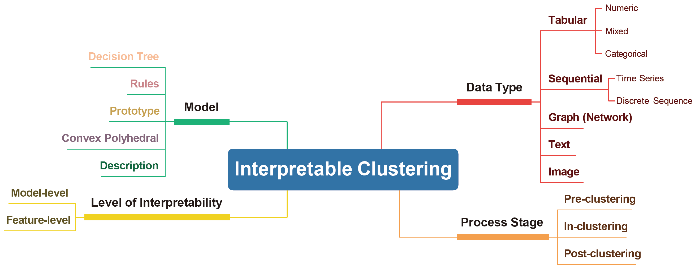
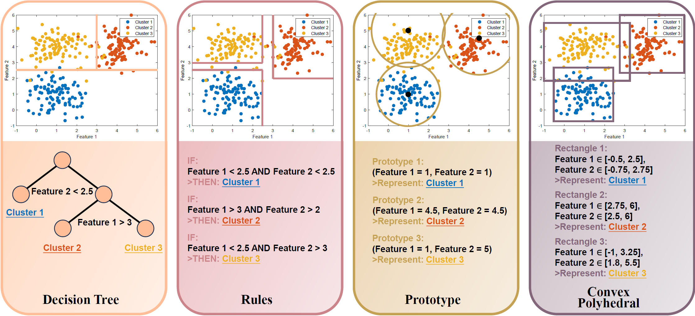

# Awesome Interpretable Clustering 

  

This repository is a curated collection of literature on **Interpretable Clustering**, offering a comprehensive and structured perspective on the current state of interpretable and explainable clustering methods. It highlights **key criteria** for categorizing these methods, facilitating future research and development in this evolving field. 

If you find this repository helpful, we kindly encourage you to read and cite our paper, **"Interpretable Clustering: A Survey"**  ([read here](https://dl.acm.org/doi/epdf/10.1145/3789495); [citation](#Citation)). 

We value your feedback! If you have any suggestions or if you have your own paper that advances this topic, please contact us at hly4ml@gmail.com.

## Core Concepts of Our Paper

- ### Taxonomy

### 

- ### Interpretable Clustering Models

## Interpretable Clustering Methods

- ***Note: This paper list is still being developed.***

### In-clustering

> Interpretable in-modeling clustering methods serve as a direct source of interpretability within the broader category of interpretable clustering approaches, embedding interpretability within the algorithmic process of clustering itself.

- **Decision tree-based**

| **Title**                                                    | **Year** |      **Venue**       |                     **Code**                     |
| :----------------------------------------------------------- | :------: | :------------------: | :----------------------------------------------: |
| [Interpretable categorical data clustering via hypothesis testing](https://doi.org/10.1016/j.patcog.2025.111364) |   2025   | Pattern Recognition  |  [MATLAB](https://github.com/hulianyu/SigTree)   |
| [Significance-based decision tree for interpretable categorical data clustering](https://doi.org/10.1016/j.ins.2024.121588) |   2025   | Information Sciences |   [MATLAB](https://github.com/hulianyu/SigDT)    |
| [Significance-based interpretable sequence clustering](https://doi.org/10.1016/j.ins.2025.121972) |   2025   | Information Sciences |   [MATLAB](https://github.com/hulianyu/SigISC)   |
| [Interpretable Clustering Ensemble](https://arxiv.org/abs/2506.05877) |   2025   |        arXiv         |                                                  |
| [XClusters: Explainability-First Clustering](https://doi.org/10.1609/aaai.v37i7.25963) |   2023   |         AAAI         |                                                  |
| [Optimal Interpretable Clustering Using Oblique Decision Trees](https://doi.org/10.1145/3534678.3539361) |   2022   |         KDD          |                                                  |
| [Interpretable fuzzy clustering using unsupervised fuzzy decision trees](https://doi.org/10.1016/j.ins.2022.08.077) |   2022   | Information Sciences |                                                  |
| [Interpretable clustering: an optimization approach](https://doi.org/10.1007/s10994-020-05896-2) |   2020   |   Machine Learning   | [Julia](https://github.com/agniorf/ICOT-Example) |
| [Clustering nominal data using unsupervised binary decision trees](https://doi.org/10.1016/j.patcog.2017.01.031) |   2017   | Pattern Recognition  |       [R](http://ghattas.free.fr/cubt.php)       |

- **Rule-based**

| **Title**                                                    | **Year** |            **Venue**            |                           **Code**                           |
| :----------------------------------------------------------- | :------: | :-----------------------------: | :----------------------------------------------------------: |
| [On clustering and interpreting with rules by means of mathematical optimization](https://doi.org/10.1016/j.cor.2023.106180) |   2023   | Computers & Operations Research |                                                              |
| [Balancing the Tradeoff Between Clustering Value and Interpretability](https://doi.org/10.1145/3375627.3375843) |   2020   |              AIES               | [Python](https://github.com/sandysa/Interpretable_Clustering) |

- **Others**

| **Title**                                                    | **Year** |      **Venue**      |                        **Code**                        |
| :----------------------------------------------------------- | :------: | :-----------------: | :----------------------------------------------------: |
| [Interpretable Clustering via Multi-Polytope Machines](https://doi.org/10.1609/aaai.v36i7.20693) |   2022   |        AAAI         | [Python](https://github.com/conlaw/PolytopeClustering) |
| [Fast and explainable clustering based on sorting](https://doi.org/10.1016/j.patcog.2024.110298) |   2024   | Pattern Recognition |     [Python](https://github.com/nla-group/classix)     |
| [PC-X: Profound Clustering via Slow Exemplars](https://proceedings.mlr.press/v234/pan24a.html) |   2024   |        CPAL         |     [Python](https://github.com/Yuangang-Pan/PC-X)     |
| [An Exemplars-Based Approach for Explainable Clustering](https://doi.org/10.1137/1.9781611978032.6) |   2024   |         SDM         |                                                        |

### Post-clustering

> Post-modeling interpretability is a crucial aspect of interpretable learning, focusing on elucidating the reasoning behind decisions made by black-box models.

- **Decision tree-based**

| **Title**                                                    | **Year** |        **Venue**        |                           **Code**                           |
| :----------------------------------------------------------- | :------: | :---------------------: | :----------------------------------------------------------: |
| [Interpretable multi-view clustering](https://doi.org/10.1016/j.patcog.2025.111418) |   2025   |   Pattern Recognition   |                                                              |
| [Interpretable sequence clustering](https://doi.org/10.1016/j.ins.2024.121453) |   2025   |  Information Sciences   | [Python](https://github.com/jd445/Interpretable-Sequence-Clustering-Tree) |
| [Explaining Kernel Clustering via Decision Trees](https://openreview.net/forum?id=FAGtjl7HOw) |   2024   |          ICLR           |                                                              |
| [Shallow decision trees for explainable k-means clustering](https://doi.org/10.1016/j.patcog.2022.109239) |   2023   |   Pattern Recognition   |      [Python](https://github.com/lmurtinho/ShallowTree)      |
| [How to find a good explanation for clustering?](https://doi.org/10.1016/j.artint.2023.103948) |   2023   | Artificial Intelligence |                                                              |
| [Random Cuts are Optimal for Explainable k-Medians](https://proceedings.neurips.cc/paper_files/paper/2023/hash/d3408794e41dd23e34634344d662f5e9-Abstract-Conference.html) |   2023   |         NeurIPS         |                                                              |
| [Explainable k-means: don’t be greedy, plant bigger trees!](https://doi.org/10.1145/3519935.3520056) |   2022   |          STOC           |                                                              |
| [Almost Tight Approximation Algorithms for Explainable Clustering](https://doi.org/10.1137/1.9781611977073.103) |   2022   |          SODA           |                                                              |
| [On the price of explainability for some clustering problems](https://proceedings.mlr.press/v139/laber21a) |   2021   |          ICML           |                                                              |
| [Near-Optimal Algorithms for Explainable k-Medians and k-Means](https://proceedings.mlr.press/v139/makarychev21a) |   2021   |          ICML           |                                                              |
| [Nearly-Tight and Oblivious Algorithms for Explainable Clustering](https://proceedings.neurips.cc/paper_files/paper/2021/hash/f24ad6f72d6cc4cb51464f2b29ab69d3-Abstract.html) |   2021   |         NeurIPS         |                                                              |
| [Explainable k-Means and k-Medians Clustering](https://proceedings.mlr.press/v119/moshkovitz20a.html) |   2020   |          ICML           |          [Python](https://github.com/navefr/ExKMC)           |

- **Rule-based**

| **Title**                                                    | **Year** | **Venue** |                          **Code**                           |
| :----------------------------------------------------------- | :------: | :-------: | :---------------------------------------------------------: |
| [Explaining clusterings of process instances](https://doi.org/10.1007/s10618-016-0488-4) |   2017   |   DMKD    |                                                             |
| [Explaining Black-Box Clustering Pipelines with Cluster-Explorer](https://doi.org/10.14778/3718057.3718075) |   2025   |   VLDB    | [Python](https://github.com/analysis-bots/cluster-explorer) |

- **Others**

| **Title**                                                    | **Year** |         **Venue**          |                           **Code**                           |
| :----------------------------------------------------------- | :------: | :------------------------: | :----------------------------------------------------------: |
| [X-clustering beyond contextual representations](https://doi.org/10.1016/j.ins.2025.122291) |   2025   |    Information Sciences    |       [Python](https://github.com/TianyiHuang2022/XCR)       |
| [Explainable community detection](https://doi.org/10.1016/j.chaos.2025.116198) |   2025   | Chaos, Solitons & Fractals |         [Python](https://github.com/xuannnn523/CCTS)         |
| [Neural Clustering based Visual Representation Learning](https://doi.org/10.1109/CVPR52733.2024.00546) |   2024   |            CVPR            |         [Python](https://github.com/guikunchen/FEC)          |
| [From Clustering to Cluster Explanations via Neural Networks](https://doi.org/10.1109/TNNLS.2022.3185901) |   2024   |           TNNLS            |    [Python](https://github.com/jacobkauffmann/neon_demo)     |
| [Cluster Explanation via Polyhedral Descriptions](https://proceedings.mlr.press/v202/lawless23a) |   2023   |            ICML            | [Python](https://github.com/conlaw/PolyhedralClusterDescription) |
| [Interpreting clusters via prototype optimization](https://doi.org/10.1016/j.omega.2021.102543) |   2022   |           Omega            |                                                              |

## Citation

@Article{Hu2026xclu,
  author    = {Hu, Lianyu and Jiang, Mudi and Dong, Junjie and Liu, Xinying and He, Zengyou},
  title     = {Interpretable Clustering: A Survey},
  doi       = {10.1145/3789495},
  number    = {8},
  url       = {https://doi.org/10.1145/3789495},
  volume    = {58},
  articleno = {215},
  journal   = {ACM Computing Surveys},
  keywords  = {Interpretable clustering, algorithmic interpretability, interpretable machine learning and data mining, Explainable Artificial Intelligence (XAI)},
  year      = {2026},
}
