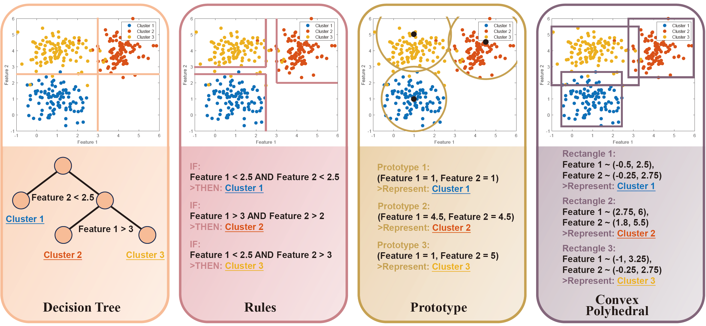

# Awesome Interpretable Clustering 

This repository is a curated collection of literature on **Interpretable Clustering**, offering a comprehensive and structured perspective on the current state of interpretable and explainable clustering methods. It highlights **key criteria** for categorizing these methods, facilitating future research and development in this evolving field. 

If you find this repository helpful, we kindly encourage you to read and cite our paper, **"Interpretable Clustering: A Survey"**  ([read here](https://arxiv.org/abs/2409.00743); [citation](#Citation)). 

We value your feedback! If you have any suggestions or if you have your own paper that advances this topic, please contact us at hly4ml@gmail.com.

## Core Concept of Our Paper

### Taxonomy

### Interpretable Clustering Models

## Interpretable Clustering Methods

- ***Note: This paper list is still being developed.***

### In-clustering

> Interpretable in-modeling clustering methods serve as a direct source of interpretability within the broader category of interpretable clustering approaches, embedding interpretability within the algorithmic process of clustering itself.

- **Decision tree-based**

|                          **Title**                           | **Year** |      **Venue**      |                     **Code**                     |
| :----------------------------------------------------------: | :------: | :-----------------: | :----------------------------------------------: |
| [Optimal Interpretable Clustering Using Oblique Decision Trees](https://doi.org/10.1145/3534678.3539361) |   2022   |         KDD         |                                                  |
| [XClusters: Explainability-First Clustering](https://doi.org/10.1609/aaai.v37i7.25963) |   2023   |        AAAI         |                                                  |
| [Interpretable clustering: an optimization approach](https://doi.org/10.1007/s10994-020-05896-2) |   2020   |  Machine Learning   | [Julia](https://github.com/agniorf/ICOT-Example) |
| [Clustering nominal data using unsupervised binary decision trees](https://doi.org/10.1016/j.patcog.2017.01.031) |   2017   | Pattern Recognition |       [R](http://ghattas.free.fr/cubt.php)       |
| [Interpretable categorical data clustering via hypothesis testing]() |   2025   | Pattern Recognition |  [MATLAB](https://github.com/hulianyu/SigTree)   |

- **Rule-based**

| **Title** | **Year** | **Venue** | **Code** |
| :-------: | :------: | :-------: | :------: |
|           |          |           |          |

- **Others**

| **Title** | **Year** | **Venue** | **Code** |
| :-------: | :------: | :-------: | :------: |
|           |          |           |          |

### Post-clustering

> Post-modeling interpretability is a crucial aspect of interpretable learning, focusing on elucidating the reasoning behind decisions made by black-box models.

- **Decision tree-based**

| **Title** | **Year** | **Venue** | **Code** |
| :-------: | :------: | :-------: | :------: |
|           |          |           |          |

- **Rule-based**

| **Title** | **Year** | **Venue** | **Code** |
| :-------: | :------: | :-------: | :------: |
|           |          |           |          |

- **Others**

| **Title** | **Year** | **Venue** | **Code** |
| :-------: | :------: | :-------: | :------: |
|           |          |           |          |

## Citation

    @article{hu2024interpretable,
      title={Interpretable Clustering: A Survey},
      author={Hu, Lianyu and Jiang, Mudi and Dong, Junjie and Liu, Xinying and He, Zengyou},
      journal={arXiv preprint arXiv:2409.00743},
      year={2024}
    }
